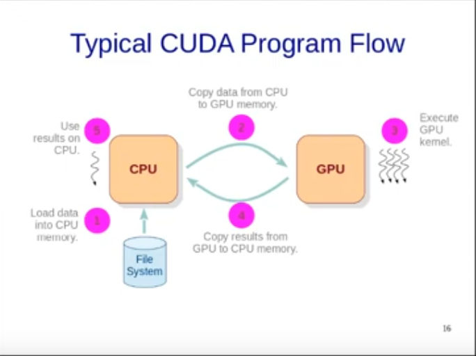

# Important Points:

## Order: 
1. hello . cu
2. fun . cu
3. threadId . cu
4. arrayfun . cu

## hello . cu: 
1. `dkernel` is just a random name for the kernel, we can use any name as our desire.
2. When calling a kernel like `dkernel<<<1,32>>>();` 32 is the number of threads, while 1 is the number of thread blocks to be used.
3. Execution of threads won't have any order. All will run parallely if allowed. If not scheduler will schedule the task when it's available.
4. `cudaDeviceSynchronize()` will make the program wait for the GPU execution before program execution continues.
5. `dkernel<<<1,32>>>();` will print "hello world" 32 times.

## threadId . cu:
1. `#define N 100` is a constant N which after compilation will be replaced by 100 in the code. It's shared by both GPU and CPU as it's not actually a variable and stored in memory.
2. `threadIdx.x` is the thread id along the x direction. Note that `.x` is responsible for the direction and can be changed to others like `.y`, `.z` etc. threadIdx is just a name and there is no relation to x direction.                                       

## arrayfun . cu 
1. `*da` is the pointer intialized on the CPU memory but it is actually storing the locations of GPU memory.
2. `cudaMalloc` is the function used to allocate memory on the GPU. It is same as normal Malloc in C.
3. `cudaMemcpy` actually copies the data from "device" --> GPU  to "host" --> CPU.
4. No `cudaDeviceSynchronize()` is used as cudaMemecpy also waits for the kernel to execute the program. Else there was a need of it.
5. cudaMemcpy waits as the memory it needs to copy is being used by kernel and thus it can't work before kernel finishes. Though there is an async version of cudaMemcpy.

                                                                                                                                                                                                                                                                                                                                                                                                                                                