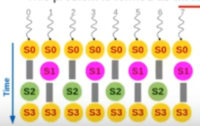

## warpwithcondition . cu
1. When different warp-threads execute different instructions, threads are said to diverge.
2. Hardware execute threads satisfying same conditions together, ensuring that threads execute a no-op.
3. This adds sequentiality to the execution.
4. This problem is termed as thread-divergence.
 


 > Degree of Divergence : DoD for a warp is the number of steps required to complete one instruction for each thread in the warp.

 Without divergence, DoD = 1

 > Note: Conditions are not bad. They evaluating to different tryuth values is also not bad. They evaluating to different truth-values for warp-threads is bad.
Eg: 

```c
if (id/32) S1 else S2; 
```
Though different truth values but it is not bad as for a single warp, they need to execute a single statement.